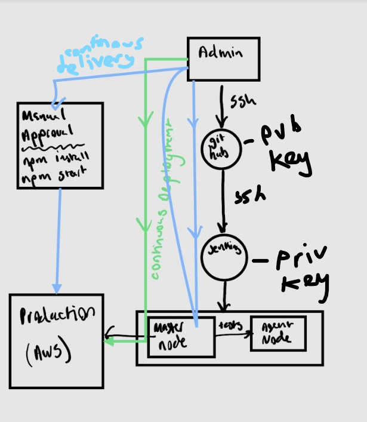
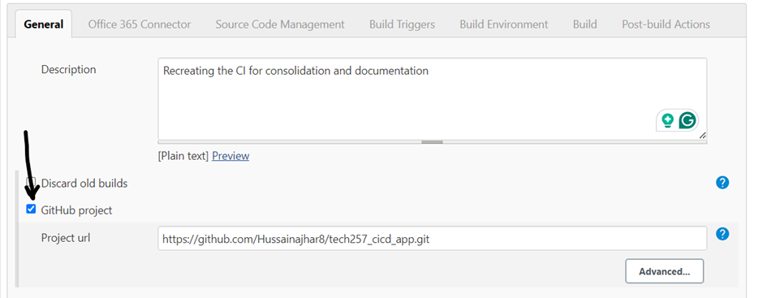
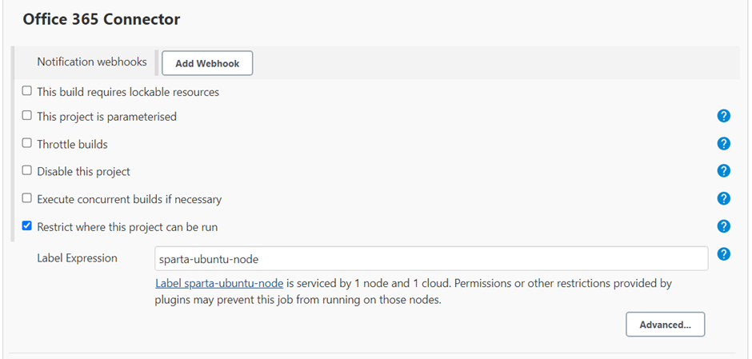
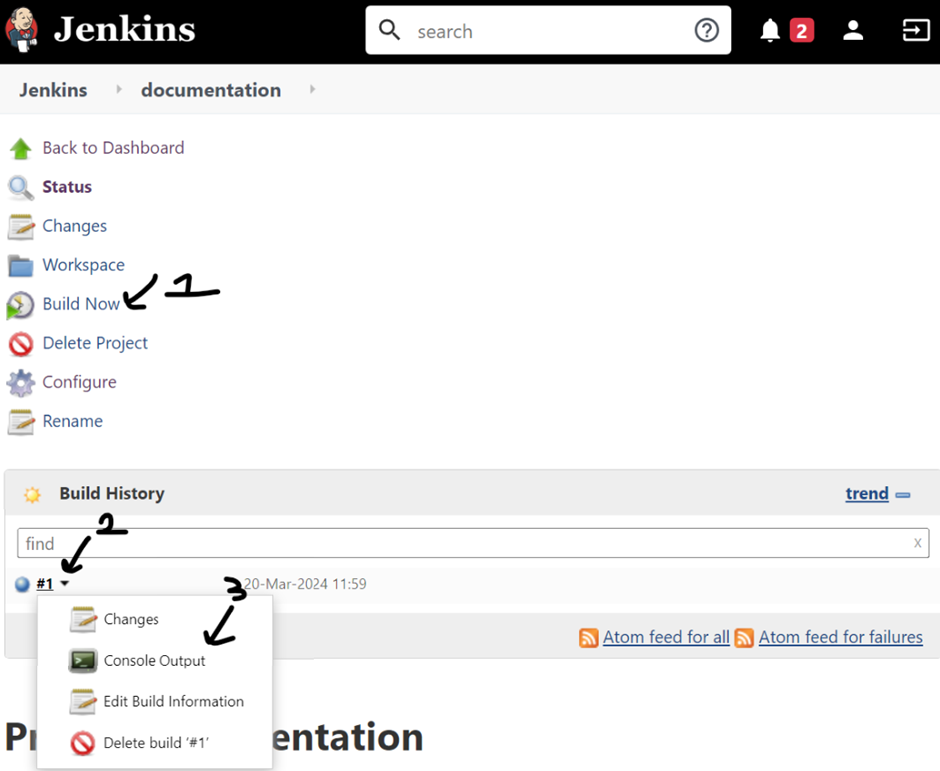
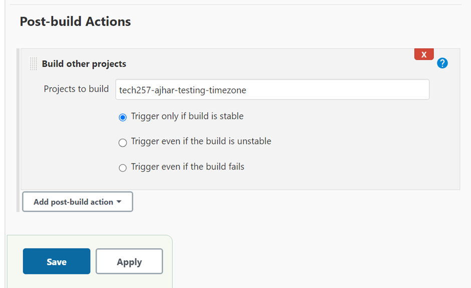
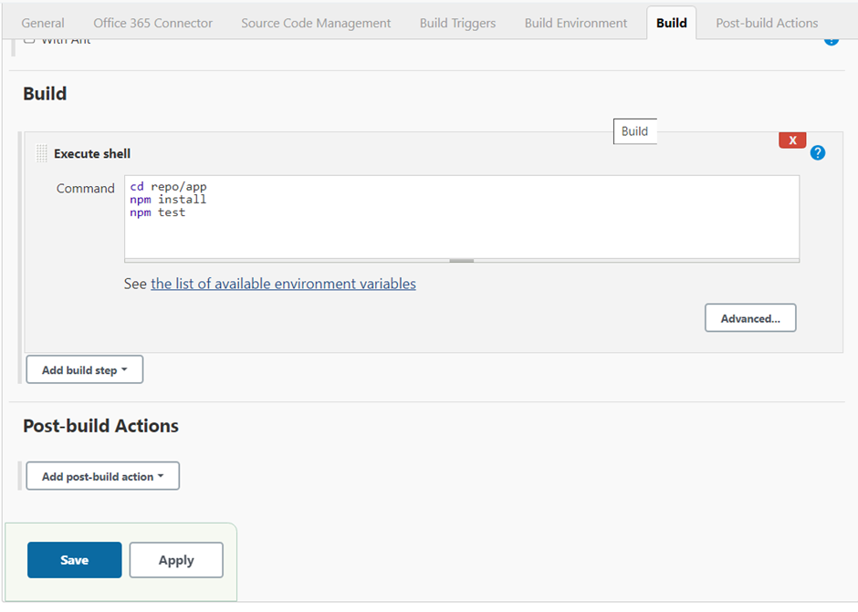
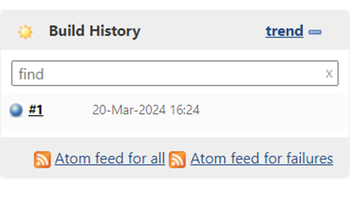
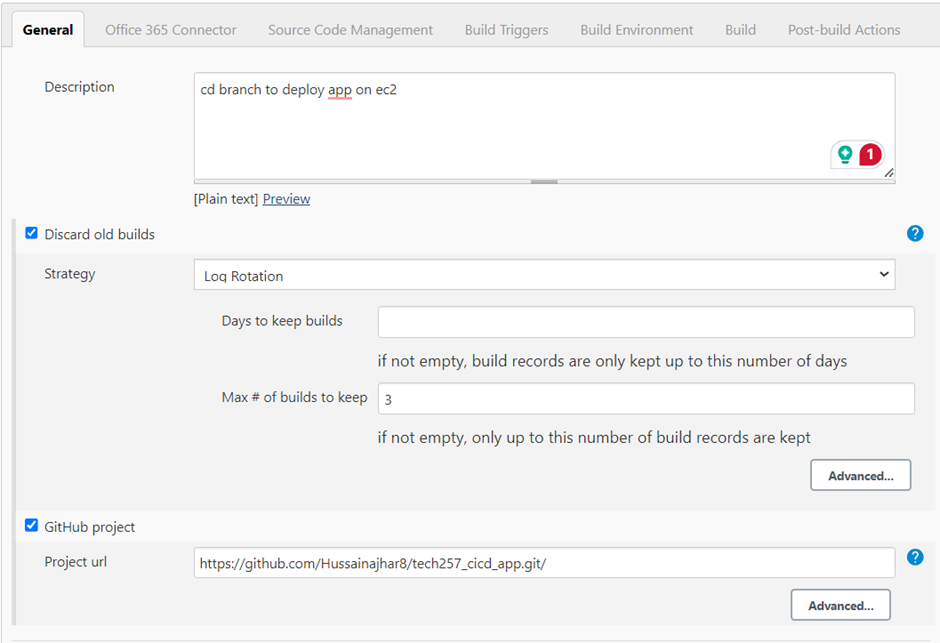

# Jenkins Setup Guide
### Jenkins Diagram

#### Creating a Basic Job

1. Go to Jenkins and log in using your credentials.
2. Click on "New Item" to create a new job.
3. Select "Freestyle project" and click "OK".
   

#### Configuring Job Setting

1. Under the "General" section, select "Discard old builds".
2. Set "Max # of builds to keep" to 3 to manage server resources efficiently.
   

#### Defining Build Steps

1. In the "Build" section, select "Execute shell" from the drop-down menu.
2. Add the commands you want the job to run.

#### Running the Job

1. Save the job configuration.
2. Click on "Build Now" to execute the job.
3. To view the status and output of the build:
   - Go to the build history.
   - Click on the specific build.
   - Select "Console Output".
  

#### Connecting Jobs

1. Upon successful execution, create another job with different commands.
2. Connect the jobs by:
   - Clicking on "Add post-build action".
   - Selecting "Build other projects".
   - Choose the build you want to trigger upon the success of the former.

(This will run the "tech257-ajhar-testing-timezone" job upon successful build of this job.)

### Setting up Continuous Integration (CI) with Jenkins

#### Creating a CI Job

1. Create a new freestyle project in Jenkins.

#### Configuring Job Settings

1. In the "General" section, select "GitHub Project".
2. Insert the HTTPS git URL into the "Project URL".
   

#### Specifying Execution Environment

1. In the "Office 365 Connector" section, select "Restrict where this project can be run".
2. Choose "sparta-ubuntu-node" as the Label Expression to designate the agent node for running tests.

#### Configuring Source Code Management

1. In the "Source Code Management" section, select "Git".
2. Insert the SSH repo URL and secret key for Jenkins to use during CI when we push changes to the main branch.
   

#### Setting Build Triggers

1. In the "Build Triggers" section, select "GitHub hook trigger for GITScm polling".
   

#### Defining Build Steps

1. Enter the build script for executing tests.
2. Save the configuration.
   

#### Testing the CI Job

1. Execute a "Build Now" to ensure the tests are successful.
   

#### Adding Webhook to GitHub Repo

1. In the GitHub repository settings, navigate to "Webhooks".
2. In the "Payload URL" field, paste your Jenkins environment URL followed by "/github-webhook/".
3. Select "application/json" as the content type and leave the "Secret" field empty.
4. Choose "Just the push event" to trigger the pipeline when code is pushed.
5. Click on "Update/Create webhook" to save the changes.
   

#### Testing the CI Pipeline

1. Push some changes from your local machine to the GitHub repository.
2. Observe Jenkins running a build job for the changes pushed.
3. Successful execution indicates the successful setup of CI.
