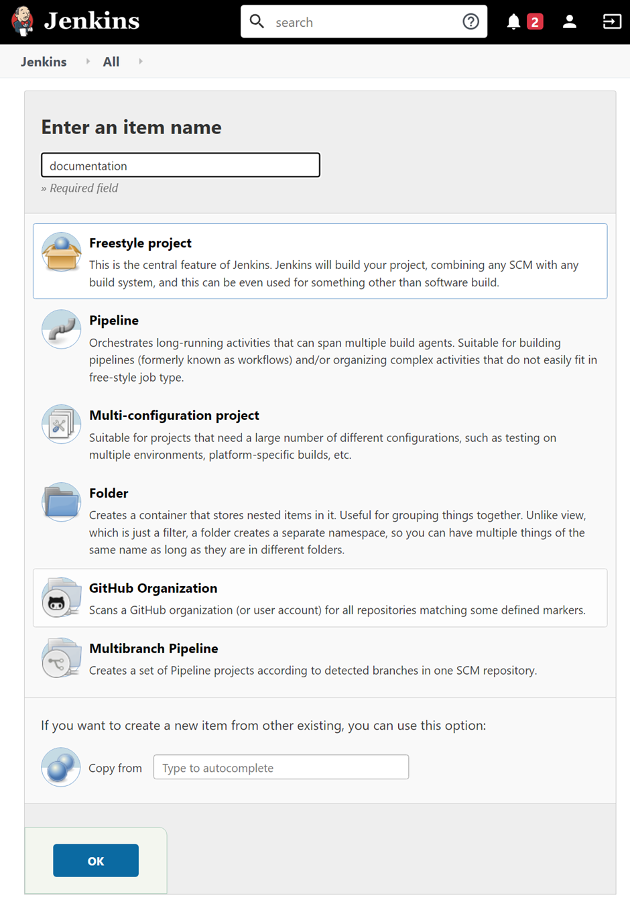
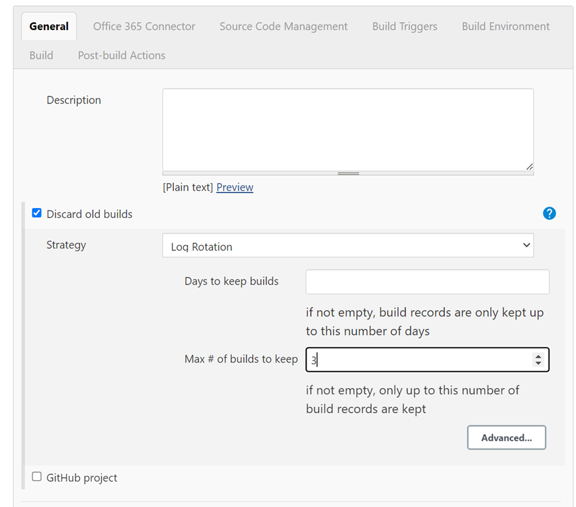
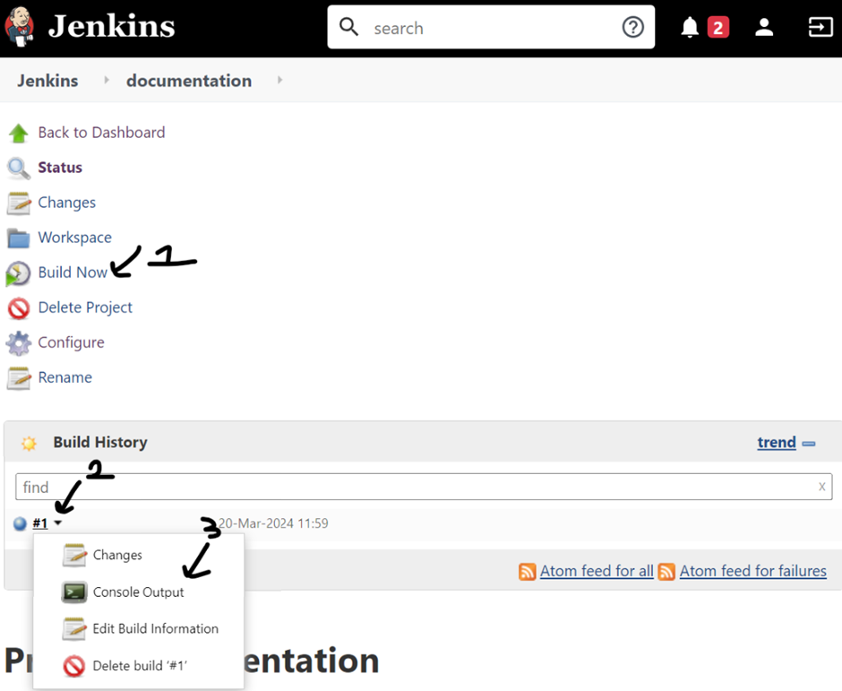
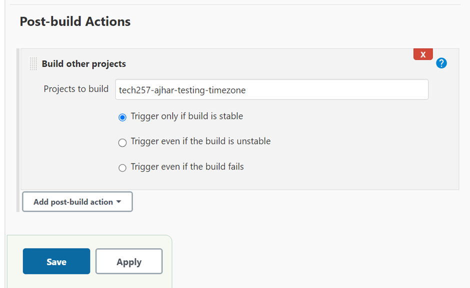

### Jenkins Setup Guide

#### Logging into Jenkins

- **URL:** [http://35.176.97.54:8080/](http://35.176.97.54:8080/)
- **Username:** devopslondon
- **Password:** DevOpsAdmin

#### Creating a Basic Job

1. Go to Jenkins and log in using the provided credentials.
2. Click on "New Item" to create a new job.
3. Select "Freestyle project" and click "OK".
   

#### Configuring Job Settings

1. Under the "General" section, select "Discard old builds".
2. Set "Max # of builds to keep" to 3 to manage server resources efficiently.
   

#### Defining Build Steps

1. In the "Build" section, select "Execute shell" from the drop-down menu.
2. Add the commands you want the job to run.

#### Running the Job

1. Save the job configuration.
2. Click on "Build Now" to execute the job.
3. To view the status and output of the build:
   - Go to the build history.
   - Click on the specific build.
   - Select "Console Output".
  

#### Connecting Jobs

1. Upon successful execution, create another job with different commands.
2. Connect the jobs by:
   - Clicking on "Add post-build action".
   - Selecting "Build other projects".
   - Choose the build you want to trigger upon the success of the former.

(This will run the "tech257-ajhar-testing-timezone" job upon successful build of this job.)
