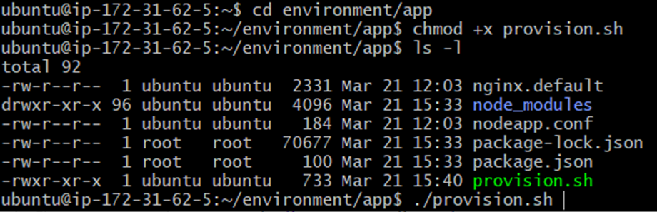
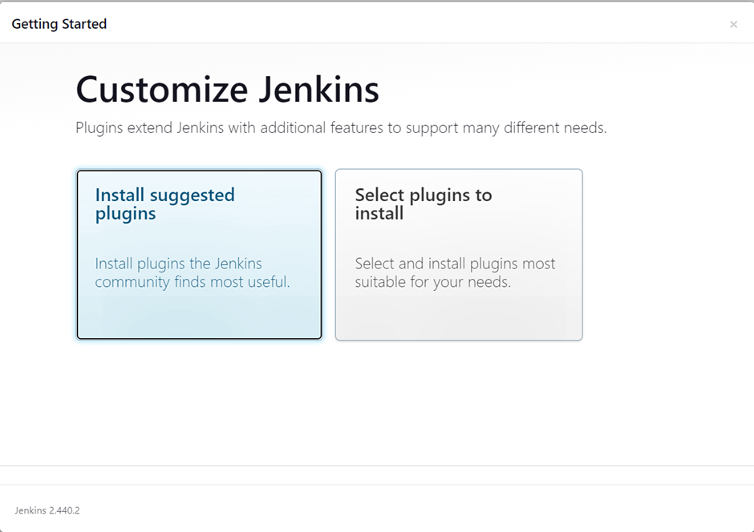

# Jenkins Setup Guide
### Jenkins Diagram

#### Creating a Basic Job

1. Go to Jenkins and log in using your credentials.
2. Click on "New Item" to create a new job.
3. Select "Freestyle project" and click "OK".
   

#### Configuring Job Setting

1. Under the "General" section, select "Discard old builds".
2. Set "Max # of builds to keep" to 3 to manage server resources efficiently.
   

#### Defining Build Steps

1. In the "Build" section, select "Execute shell" from the drop-down menu.
2. Add the commands you want the job to run.

#### Running the Job

1. Save the job configuration.
2. Click on "Build Now" to execute the job.
3. To view the status and output of the build:
   - Go to the build history.
   - Click on the specific build.
   - Select "Console Output".
  

#### Connecting Jobs

1. Upon successful execution, create another job with different commands.
2. Connect the jobs by:
   - Clicking on "Add post-build action".
   - Selecting "Build other projects".
   - Choose the build you want to trigger upon the success of the former.

(This will run the "tech257-ajhar-testing-timezone" job upon successful build of this job.)

## Setting up Continuous Integration (CI) with Jenkins

#### Creating a CI Job

1. Create a new freestyle project in Jenkins.

#### Configuring Job Settings

1. In the "General" section, select "GitHub Project".
2. Insert the HTTPS git URL into the "Project URL".
   

#### Specifying Execution Environment

1. In the "Office 365 Connector" section, select "Restrict where this project can be run".
2. Choose "sparta-ubuntu-node" as the Label Expression to designate the agent node for running tests.


#### Configuring Source Code Management

1. In the "Source Code Management" section, select "Git".
2. Insert the SSH repo URL and secret key for Jenkins to use during CI when we push changes to the main branch.
   

#### Setting Build Triggers

1. In the "Build Triggers" section, select "GitHub hook trigger for GITScm polling".
   

#### Defining Build Steps

1. Enter the build script for executing tests.
2. Save the configuration.
   

#### Testing the CI Job

1. Execute a "Build Now" to ensure the tests are successful.
   

#### Adding Webhook to GitHub Repo

1. In the GitHub repository settings, navigate to "Webhooks".
2. In the "Payload URL" field, paste your Jenkins environment URL followed by "/github-webhook/".
3. Select "application/json" as the content type and leave the "Secret" field empty.
4. Choose "Just the push event" to trigger the pipeline when code is pushed.
5. Click on "Update/Create webhook" to save the changes.
   

#### Testing the CI Pipeline

1. Push the changes from your local machine to the GitHub repository.
2. Observe Jenkins running a build job for the changes pushed.
3. Successful execution indicates the successful setup of CI.

## Setting up CI Merge Job

#### Creating a Development Branch

1. Create a new branch called "dev".
   

#### Modifying CI Job Configuration

1. In the existing CI job, change the branch from "main" to "dev" in the configuration settings.
   

#### Creating CI Merge Job

1. Create a new freestyle project for the CI merge job.
2. Configure the job similar to the previous CI job.
3. Insert the project URL.
   

#### Specifying Execution Environment

1. Configure the `sparta_ubuntu_node` to run the CI merge job.

#### Configuring Source Code Management

1. Use the same source code management settings as the previous job.
2. Ensure it is configured to pull code from the "main" branch.
   

#### Defining Build Steps

1. Add a post-build script to merge the "dev" branch into the "main" branch.
   

#### Triggering Merge Job

1. Configure the CI job to trigger the merge job upon successful build.
   

#### Confirmation of Pipeline Functionality

After testing, it has been confirmed that the pipeline is functional and operational.


## Deploying the Application

To deploy the application, follow these steps:

1. **Create EC2 Instance:**
   - Launch a new EC2 instance on AWS.
     

2. **Set Up Jenkins Job:**
   - Create a new Jenkins job and insert the GitHub project URL.
     
   - Configure the source code management, providing the private key for accessing our repository.
     

3. **Configure Build Environment:**
   - Set up an SSH agent in the build environment.
   - Provide the PEM file for Jenkins to access the EC2 instance.
     

4. **Build Process:**
   - In the build section, add commands for Jenkins to set up an Nginx server on the EC2 instance.
     

5. **Verify Deployment:**
   - After the build process, access the IP address of the EC2 instance to ensure that the default webpage is displayed.
     

## Setting Up Application on Port 3000

To configure our application to run on port 3000, follow these steps:

1. **Update Application and Environment:**
   - Ensure that the latest version of the application and environment folder is available on our VM.
   - Use the `rsync` command in the "ajhar-cd" job script in Jenkins to synchronize the folders.
   

2. **SSH into EC2 Instance:**
   - Use SSH to connect to the EC2 instance:
     ```bash
     ssh -i "tech257.pem" ubuntu@ec2-18-201-139-145.eu-west-1.compute.amazonaws.com
     ```

3. **Navigate to Script Folder:**
   - Change directory to the script folder, set permissions, and execute the script:
     ```bash
     cd environment/app
     chmod +x provision.sh
     ./provision.sh
     ```
     

4. **Install Dependencies and Start Application:**
   - After the script execution, navigate to the app folder install npm dependencies then start npm:
     ```bash
     cd ~/app
     npm install
     npm start
     ```
     

6. **Access Application:**
   - Verify that the application is accessible at port 3000.
   

7. **Automate with Jenkins:**
   - Once the manual process is confirmed to work, integrate these steps into our Jenkins shell script.
   

## Continuous Deployment

### Manual Deployment:
1. **SSH into VM:**
   - Use SSH to connect to our VM and navigate to the app folder:
     ```bash
     ssh -i "tech257.pem" ubuntu@<ip_address>
     cd /home/ubuntu/app
     ```
     

2. **Provisioning Script:**
   - Ensure permission and execute the provisioning script:
     ```bash
     chmod +x ~/environment/app/provision.sh
     ~/environment/app/provision.sh
     ```
     

3. **Install Dependencies:**
   - Verify npm installation in the app folder and install pm2:
     ```bash
     npm install
     sudo npm install pm2@latest -g
     ```
     
     

4. **Kill Node Processes:**
   - Terminate any existing node processes to free port 3000:
     ```bash
     pm2 kill
     ```
     

5. **Start Application with PM2:**
   - Start the application with pm2 and save the process to run in the background:
     ```bash
     pm2 start app.js
     pm2 save
     ```
     

6. **Confirm Application Deployment:**
   - Ensure the application is running in the background using pm2 by checking domain.
   

#### Automated Deployment (Jenkins):
1. **Jenkins Shell Script:**
   - Use the following script in Jenkins to automate the deployment process:
   
     ```bash
     # Synchronize "app" to "/home/ubuntu/" on our app vm
     rsync -avz -e "ssh -o StrictHostKeyChecking=no" repo/app ubuntu@52.51.186.165:/home/ubuntu/

     # Synchronize "environment" to "/home/ubuntu/" on our app vm
     rsync -avz -e "ssh -o StrictHostKeyChecking=no" repo/environment ubuntu@52.51.186.165:/home/ubuntu/

     # Ensure aws sg allows ssh to jenkins ip, tech257 pem provided to jenkins and ec2 is runnning
     ssh -o "StrictHostKeyChecking=no" ubuntu@52.51.186.165 <<EOF
      sudo apt-get update -y
      sudo apt-get upgrade -y
      sudo apt-get install nginx -y
      sudo systemctl restart nginx
      sudo systemctl enable nginx
      
      cd ~/app
      chmod +x ~/environment/app/provision.sh
      ../environment/app/provision.sh
      
      npm install
      sudo npm install pm2@latest -g
      pm2 kill
      pm2 start app.js
      pm2 save
     EOF
     ```
     
#### Testing Deployment:
- Manually kill pm2 in the VM to disable application.

- Confirm application is no longer accessible.
  
- Trigger the "ajhar-cd" job in Jenkins.
   
- Verify successful build and deployment of the application.
  

#### Note:
- The confirmation URL for the deployed application is not accessible due to being stopped.

## Testing Working Pipeline with Git Push from Local Machine

1. **Commit and Push Changes:**
   - Commit your local changes and push them to the remote repository:
     ```bash
     git add .
     git commit -m "Your commit message"
     git push origin main
     ```

2. **Monitor Jenkins Build:**
   - Jenkins will automatically detect the changes pushed to the dev branch and trigger the pipeline. From monitoring the Jenkins dashboard for the build and deployment progress we can see our pipeline has worked successfully.

## Installing and Setting up Jenkins on Ubuntu EC2 Instance

1. **Create EC2 Instance:**
   - Launch an EC2 instance with the Ubuntu image and t2.micro instance type.
   
   - In the security group settings, allow access to ports 22, 80, and 8080.
   

2. **SSH into the Instance:**
   - Connect to the EC2 instance via SSH.
   

3. **Update System:**
   - Ensure the system is up-to-date:
     ```bash
     sudo apt update -y
     sudo apt upgrade -y
     ```

4. **Install Java:**
   - Jenkins requires Java, install OpenJDK:
      ```bash
      sudo apt update -y
      sudo apt install fontconfig openjdk-17-jre -y
      java -version
      openjdk version "17.0.8" 2023-07-18
      OpenJDK Runtime Environment (build 17.0.8+7-Debian-1deb12u1)
      OpenJDK 64-Bit Server VM (build 17.0.8+7-Debian-1deb12u1, mixed mode, sharing)
      ```


5. **Install Jenkins:**
   - Download Jenkins repository key and add Jenkins package repository:
     ```bash
      sudo wget -O /usr/share/keyrings/jenkins-keyring.asc \
      https://pkg.jenkins.io/debian-stable/jenkins.io-2023.key
      echo deb [signed-by=/usr/share/keyrings/jenkins-keyring.asc] \
      https://pkg.jenkins.io/debian-stable binary/ | sudo tee \
      /etc/apt/sources.list.d/jenkins.list > /dev/null
      sudo apt-get update -y
      sudo apt-get install jenkins -y
      ```


6. **Start Jenkins:**
   - Enable and start Jenkins service:
     ```bash
     sudo systemctl enable jenkins
     sudo systemctl start jenkins
     ```

7. **Check Jenkins Status:**
   - Verify Jenkins service status:
     ```bash
     sudo systemctl status jenkins
     ```
     

8. **Access Jenkins Web Interface:**
   - If Jenkins is running, access it via `<public-ip>:8080` in a web browser.
    
   - Retrieve the initial admin password:
     ```bash
     sudo cat /var/lib/jenkins/secrets/initialAdminPassword
     ```
   
   - Enter the provided password in the browser.
   - Select "Install suggested plugins" for plugin installation.
   
   - Set up the first admin user.
   
   - Save and finish the setup.
   
9. **Setup Complete:**
   - Jenkins server is successfully deployed on the Ubuntu EC2 instance.
   
   
